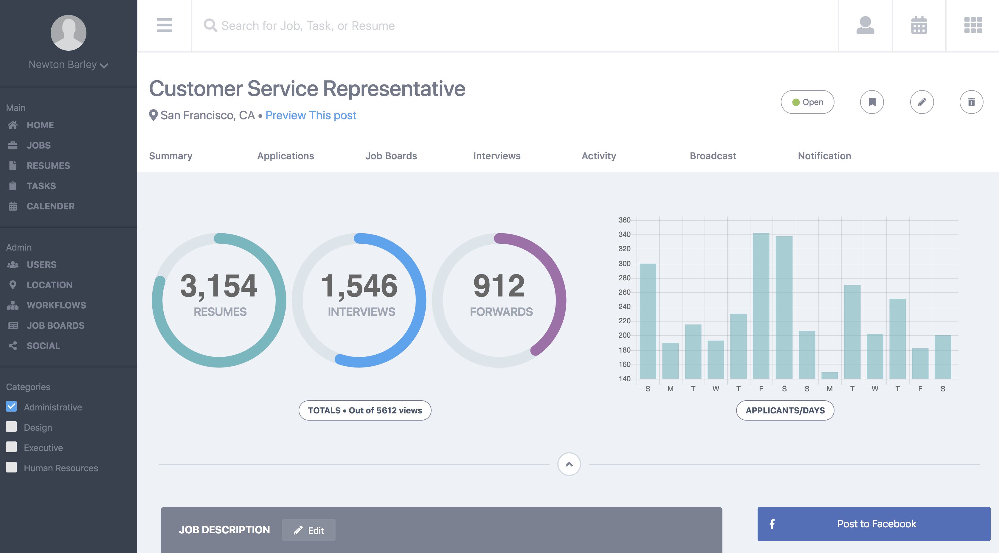

# aj-comp-challenge-3

**Specification**
The static comp challenge is a series of three challenges to keep you working that HTML/CSS muscle. :muscle: You will be asked to recreate a static comp, with each growing in complexity. For each challenge, you’ll be given a static comp and asked to recreate it. Don’t worry, we’ll give you a bit of creative license, however the objective is to build something that respects the integrity of the original design. Once you get into the workforce - building out comps that reflect the designer’s choice in layout, spacing, font, imagery, and color to the smallest detail is a requirement.

### Original Design

### My Design

